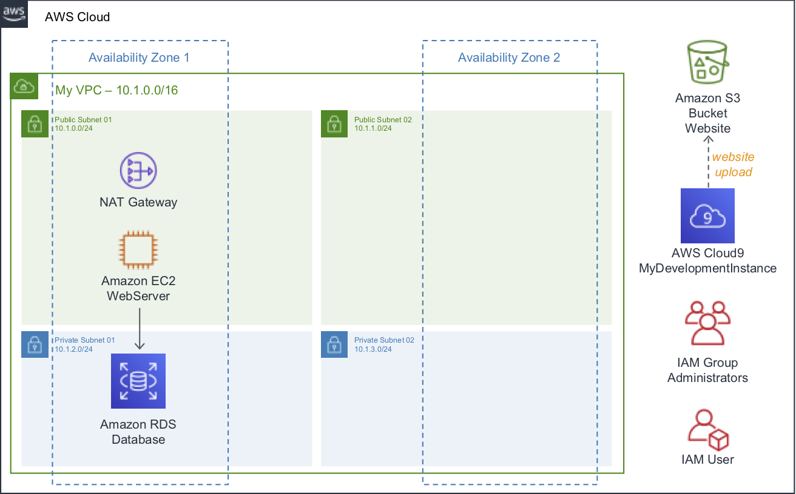

# Immersion Day Core Services

Hello, this is a self-paced workshop designed to explore the AWS Core Services.

In this workshop, you will host a Static Website and build 2-tier Application Architecture, covering the core services and best practices for Compute, Networking, Storage and Databases.

See the diagram below for a depiction of the complete architecture.

## AWS Account Required

In order to complete these workshops you'll need a valid active AWS Account with Admin permissions. Use a personal account or create a new AWS account to ensure you have the neccessary access. This should not be an AWS account from the company you work for.

**If the resources that you use for this workshop are left undeleted you will incur charges on your AWS account.**

## To start

Visit the portal to get started: http://aws-core-services.ws.kabits.com

## Modules

You must complete the following modules in **US East (N. Virginia)** region in order before proceeding to the next:

- [Getting Started with Identity & Access Management](docs/getting-started-with-iam.md "Amazon IAM")
- Publish a Static WebSite
    - [Getting Started with Amazon S3](docs/getting-started-with-amazon-s3.md "Amazon S3")
- Two-tier Application (Linux)
    - [Getting Started with Amazon VPC](docs/getting-started-with-amazon-vpc.md "Amazon VPC")
    - [Getting Started with Linux on Amazon EC2](docs/getting-started-with-linux-on-amazon-ec2.md "Amazon EC2")
    - [Getting Started with Amazon RDS](docs/getting-started-with-amazon-rds-new.md "Amazon RDS")
    - [Getting Started with Amazon RDS (Previous interface)](docs/getting-started-with-amazon-rds.md "Amazon RDS")