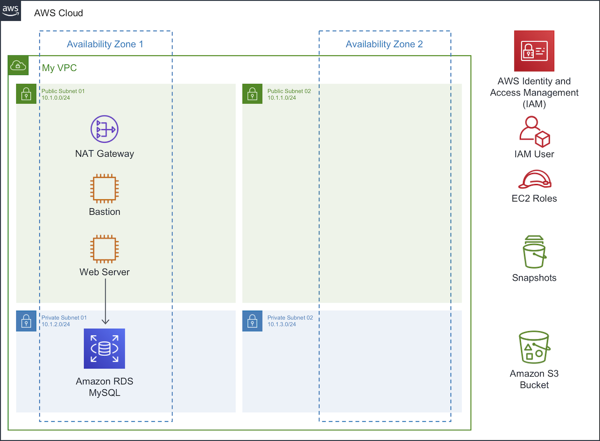

# Immersion Day Core Services

Hello, this is a self-paced workshop designed to explore the AWS Core Services.

In this workshop, you will build 2-tier application architecture and host a static website, covering the core services and best practices for Compute, Networking, Storage and Databases.

See the diagram below for a depiction of the complete architecture.

## To start

Visit the portal to get started: http://aws-core-services.ws.kabits.com

## Modules

This workshop is broken up into multiple modules. you must complete the following modules in **US East (N. Virginia)** region in order before proceeding to the next:

1\. [Getting Started with Identity & Access Management](tutorials/getting-started-with-iam.md "Amazon IAM")

2\. [Getting Started with Amazon VPC](tutorials/getting-started-with-amazon-vpc.md "Amazon VPC")

3\. [Getting Started with Linux on Amazon EC2](tutorials/getting-started-with-linux-on-amazon-ec2.md "Amazon EC2")

4\. [Getting Started with Amazon S3](tutorials/getting-started-with-amazon-s3.md "Amazon S3")

5\. [Getting Started with Amazon RDS](tutorials/getting-started-with-amazon-rds.md "Amazon RDS")