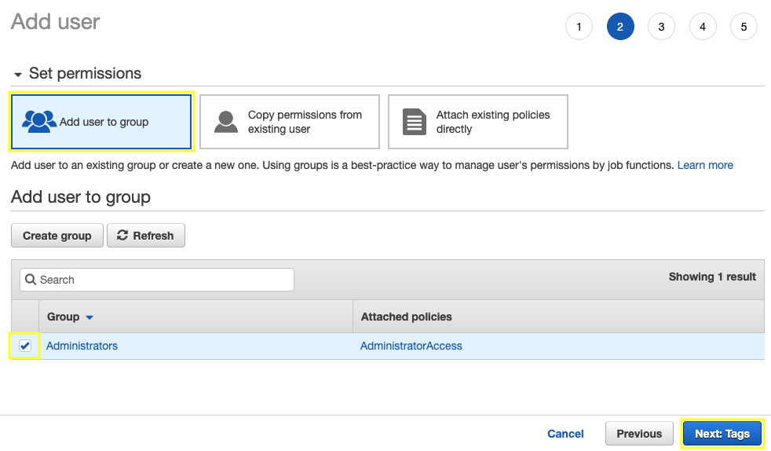
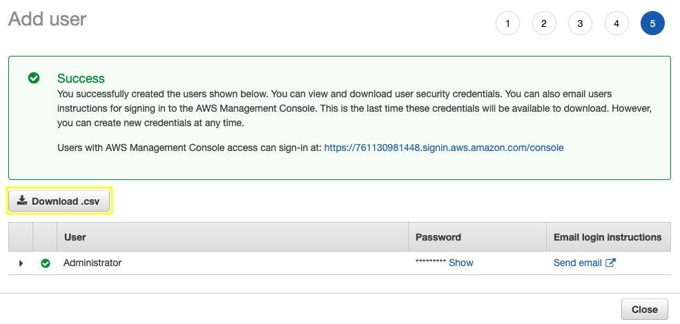

A user is associated with permanent credentials and has permissions based off of policies attached directly to the user or policies attached to a group to which the user belongs.

2.1\. Open the IAM console at https://console.aws.amazon.com/iam/.

2.2\. In the navigation pane, choose **Users** and then choose **Add user**.

2.3\. In the **User Name** box, type `Administrator` as the name of the user, for **Access type** select the check box **AWS Management Console access** and then click **Next: Permissions**.

2.4\. On the **Set permissions** page, select the check box for **Administrators** group and then click **Next: Tags**.

2.5\. On the **Add Tags** page choose **Next: Review**.

2.6\. On the **Review** page you will see all of the choices you made up to this point. When you are ready to proceed, choose **Create user**.

2.7\. To save the credentials, choose **Download .csv** and then save the file to a safe location, and **Close**.

{}
Open the **.csv** file and use the new credentials to get into your AWS Console with administrator access.
{}