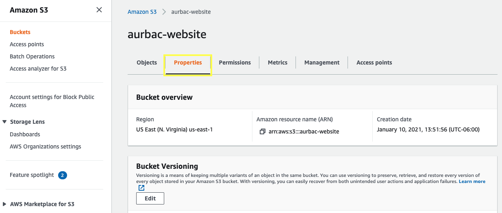
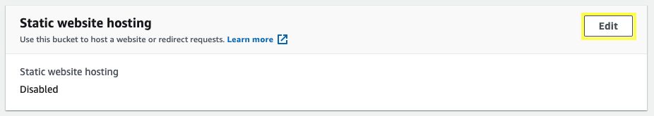
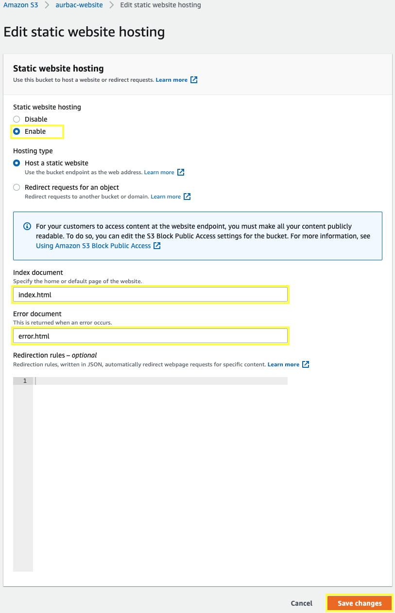
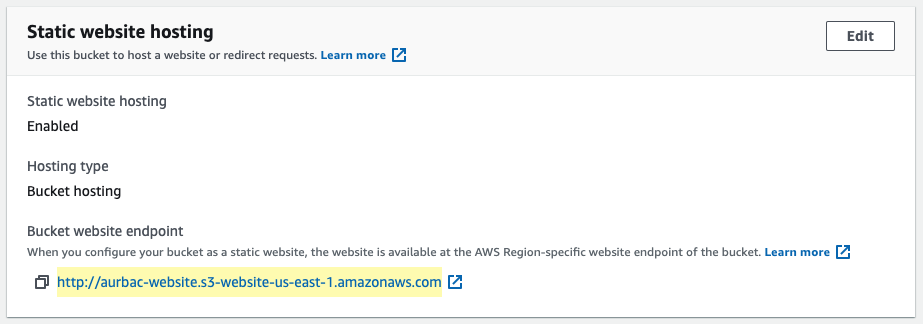

3.1\. Inside your Amazon S3 bucket, choose **Properties**.

3.2\. Scroll down to **Static website hosting** section and choose **Edit**.

3.3\. For **Static website hosting** choose **Enable**, for **Index document** type `index.html` and for **Error document** type `error.html`, click **Save changes**.

3.4\. Copy the **Bucket website endpoint** created for you website.

3.5\. Open a new browser tab and browse the static website by entering the Endpoint copied. You should see a website that looks like the following:

**Great Job! You have deployed a static website!!**