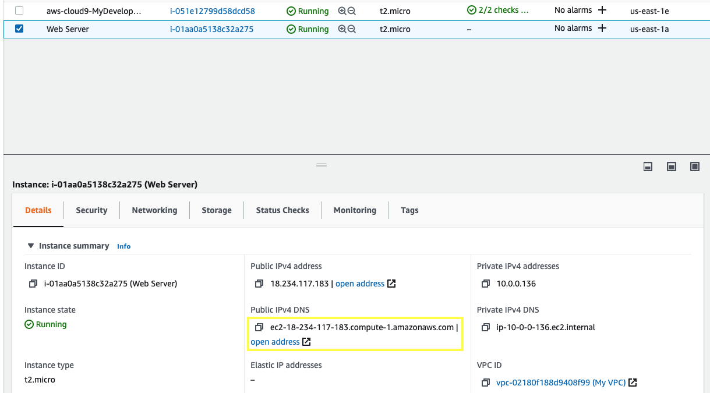
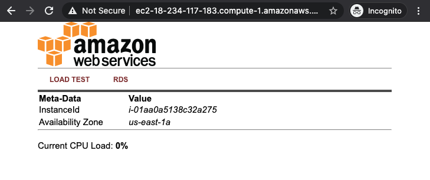

4.1\. Wait for the instance to pass the Status Checks to finish loading.

4.2\. In the **Description** of the EC2 instance you can find the Public DNS name, copy it and paste in a new browser tab and browse the Web Server by entering Public DNS name into the browser.

You should see a website that looks like the following:

