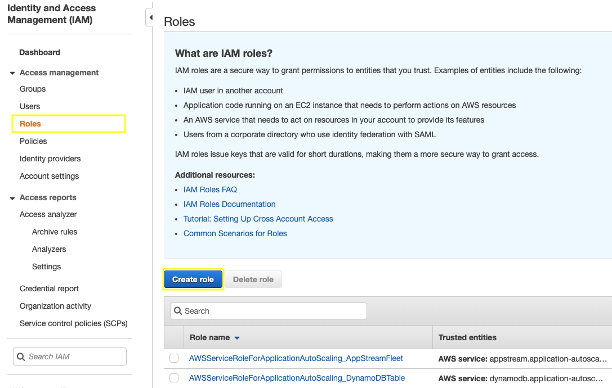
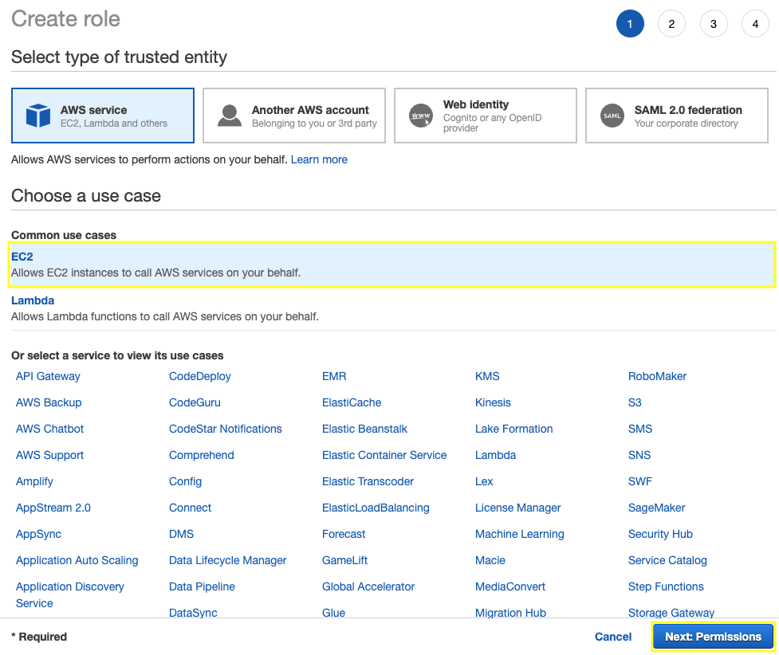
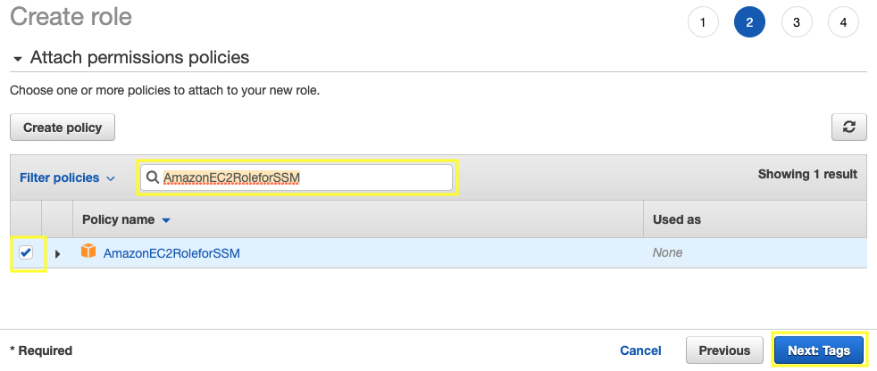

We are going to create an IAM role and attach it to an instance during or after launch. With this we will have permissions for AWS Systems Manager to use Session Manager and have access to the Linux EC2 instance.

2.2.1\. Open the IAM console at https://console.aws.amazon.com/iam/.

2.2.2\. In the navigation pane, choose **Roles** and then choose **Create role**.

2.2.3\. Choose **EC2** from the list of services, then **Next: Permissions**.

2.2.4\. For **attach permissions policies** filter by typing **AmazonEC2RoleforSSM** and from the list select **AmazonEC2RoleforSSM**, choose **Next: Tags**.

2.2.5. For Add tags choose **Next: Review**.

2.2.6. For **Role name**, type `WebServerRole` and choose **Create Role**.