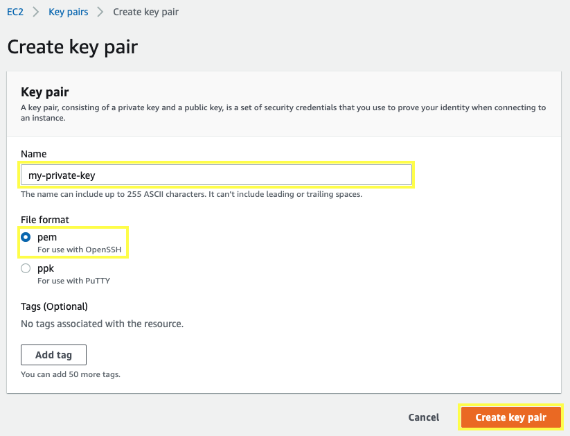

With the following steps you will create a unique SSH keypair to connect to your EC2 instance.

2.1.1\. Open the Amazon EC2 console at https://console.aws.amazon.com/ec2.

2.1.2\. Click on **Key Pairs** in the **NETWORK & SECURITY** section menu. This will display a page to manage your key pairs.

2.1.3\. To create a new key pair, click the **Create Key Pair** button at the top of the browser window.

2.1.4\. For **Name** type `my-private-key`, for **File format** select **pem** and click **Create key pair**.

2.1.5\. The page will download the file ***my-private-key.pem** to the local drive. Follow the browser instructions to save the file to the default download location.

2.1.6\. Remember the full path to the file .pem file you just downloaded.

{}
With the key pair you can [connect to your Linux instance using SSH](https://docs.aws.amazon.com/AWSEC2/latest/UserGuide/AccessingInstancesLinux.html).
{}
