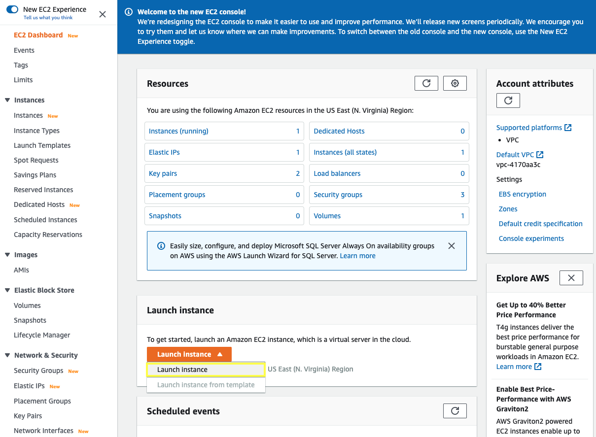
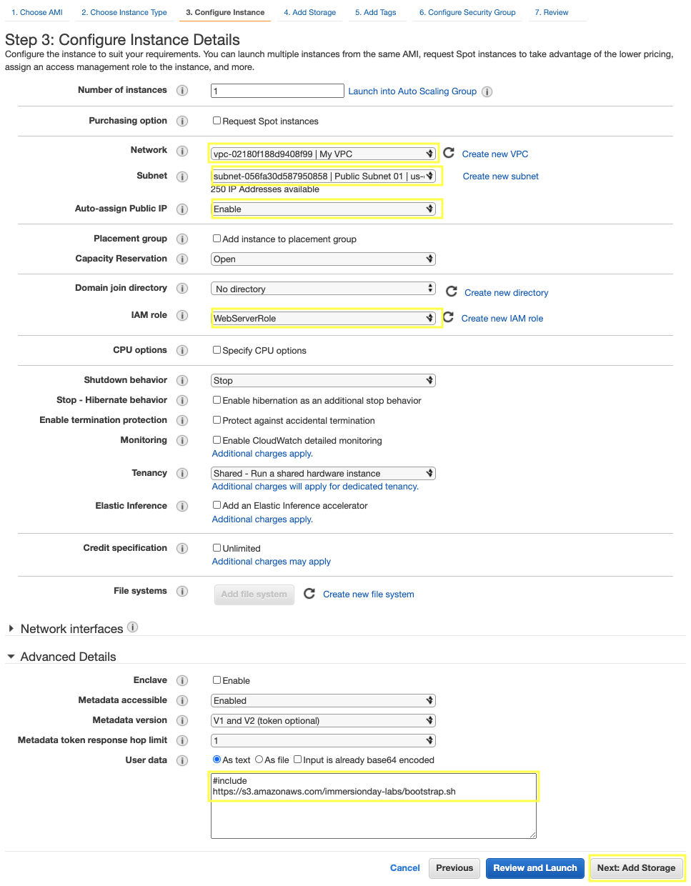
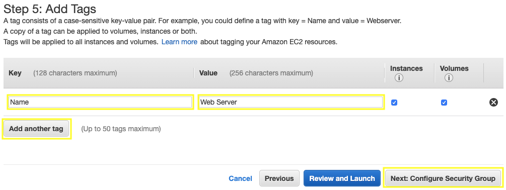
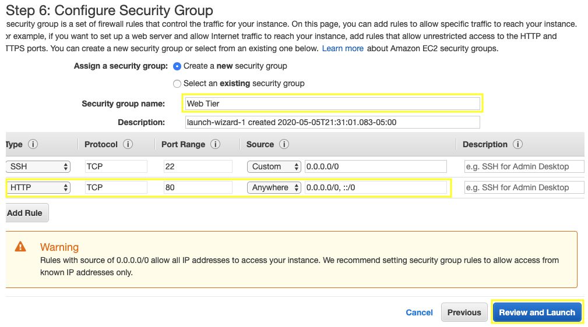
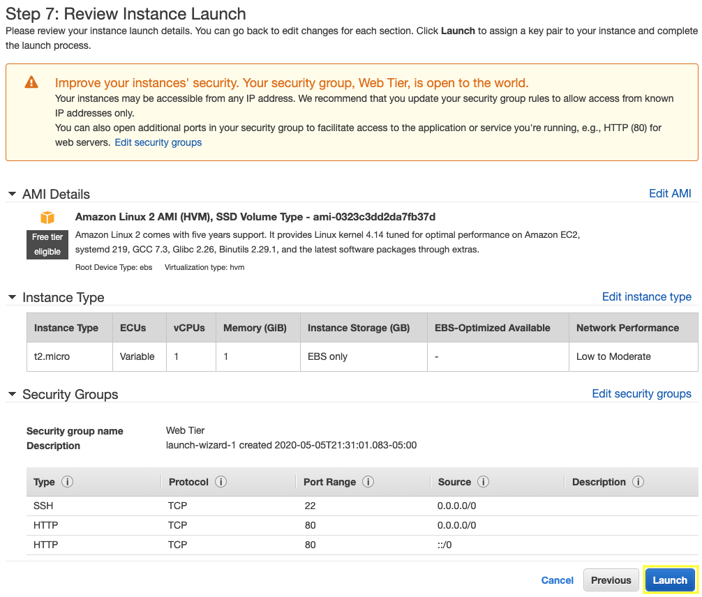
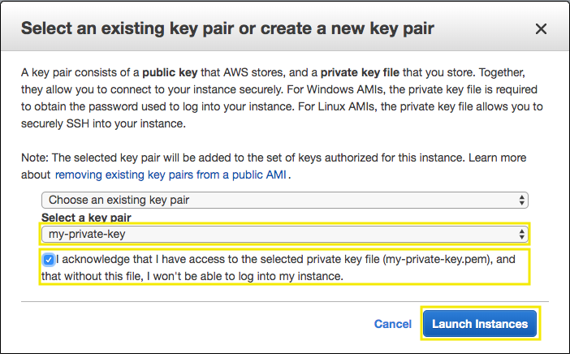
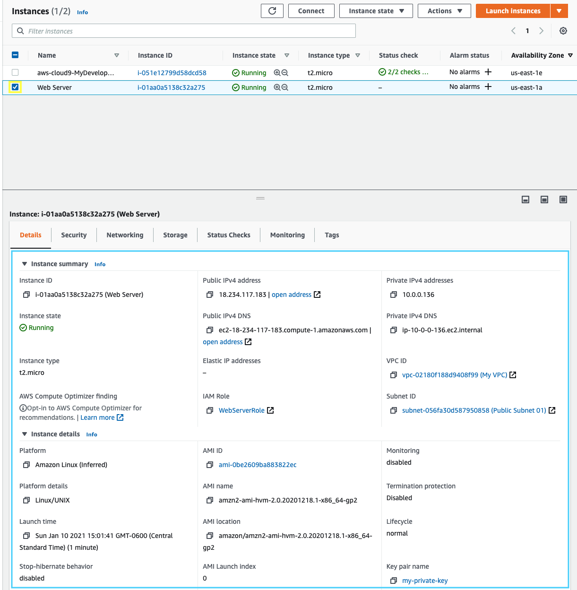

We will launch an Amazon Linux 2 instance, bootstrap Apache/PHP, and install a basic web page that will display information about our instance.

3.1\. Open the Amazon EC2 console at https://console.aws.amazon.com/ec2.

3.2\. Click on **Launch Instance**.



3.3\. In the **Step 1: Choose an Amazon Machine Image (AMI)** section, select the first Amazon Linux 2 AMI and click **Select**.


3.4\. In the **Step 2: Choose an Instance Type** section, select the **t2.micro** instance size and click **Next: Configure Instance Details**.


3.5\. In the **Step 3: Configure Instance Details** section, select your network **My VPC** created and the **Public Subnet 01**, for Auto-assign Public IP select **Enable**, for IAM role select **WebServerRole**, expand the **Advanced Details** section, copy/paste the script below into the **User Data** field (this shell script will install Apache & PHP, start the web service, and deploy a simple web page). Click **Next: Add Storage**.

```console
#include
https://s3.amazonaws.com/immersionday-labs/bootstrap.sh
```



3.6\. In **Step 4: Add Storage** section you have the ability to modify or add storage and disk drives to the instance. For this lab, we will simply accept the storage defaults and click **Next: Add Tags**.


3.7\. In **Step 5: Add Tags** section we will choose a “friendly name” for the instance by choosing **Add Tag**. Tag it with **Key**: `Name` and  **Value**: `Web Server`. It makes it easy to keep track of running machines in a complex environment. Click **Next: Configure Security Group**.



3.8\. In **Step 6: Configure Security Group** section you will create a new security group, which will be your firewall. On the assumption that we are building out a Web server, name your new security group `Web Tier`, and confirm an existing **SSH** rule exists which allows **TCP** port **22** from Anywhere. Click **Add Rule**:

3.9\. Select HTTP from the **Type** dropdown menu, and confirm **TCP** port **80** is allowed from Anywhere (you’ll notice, that “Anywhere is the same as ‘0.0.0.0/0’).  Click **Add Rule**. 

3.10\. Click the **Review and Launch** button after configuring the security group.



3.11\. In **Step 7: Review Instance Launch** section, review your cofiguration and then click **Launch**.



3.12\. Select the key pair that you created in the beginning of this lab from the drop-down and check the **I acknowledge** checkbox. Then click the **Launch Instances** button.



3.13\. Scroll down and click the **View Instances** button in the lower righthand portion of the screen to view the list of EC2 instances. Once your instance has launched, you will see your Web Server as well as the Availability Zone the instance is in, and the publicly routable DNS name.

3.14\. Click the checkbox next to your Web Server to view details about this EC2 instance.

