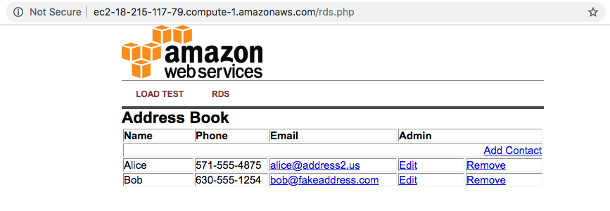

We provided an example database table and sample code for creating a simple address book.  Before configuring your instance, you will need to get the URL for your database endpoint.

3.4.1\. In the RDS console, click on **Instances** and then select your database instance, **awsdb**.

3.4.2\. Scroll down to the Connect section and check the value under **Endpoint**. Remember this because you will need it in a minute.

3.4.3\. Navigate to the browser tab connected to web application you launched previously in **Getting Started with Linux on Amazon EC2** lab, click on **RDS**. You should see a prompt to enter the **Endpoint** (**Endpoint copied**), **Database** (`immersionday`), **Username** (`awsuser`) and **Password** (`awspassword`) information you just created. Click the **Submit** button.

3.4.4\. When complete, you will be redirected to a simple page displaying all of the information from the database you just created.

This is a very basic example of a simple address book interacting with a MySQL database managed by AWS.  RDS can support much more complicated relational database scenarios, but we hope this simple example will suffice to demonstrate the point.

Feel free to play around with the address book and add/edit/remove content from your RDS database by using the Add Contact, Edit, and Remove links in the Address Book.

**Great Job: You have successfully deployed and utilized an AWS managed MySQL database!!!**