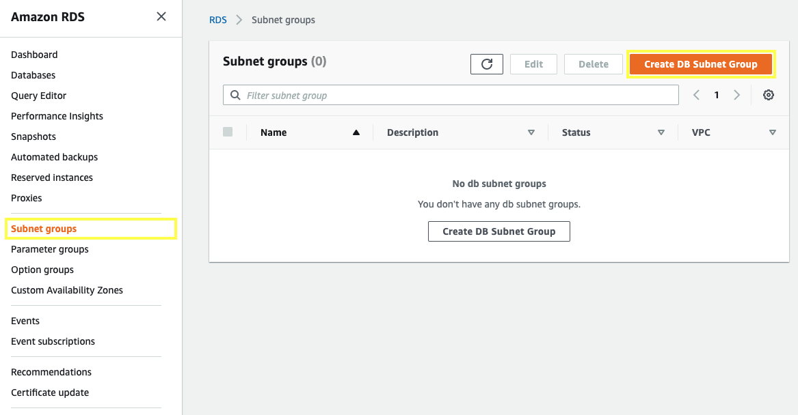

You will create a DB subnet group that is a collection of subnets (private subnets) designated for your DB instance.

3.2.1\. Open the Amazon RDS console at  https://console.aws.amazon.com/rds.

3.2.2\. In the navigation pane, choose **Subnet groups** and click on **Create DB Subnet Group**.

3.2.3\. For **Name** and **Description** type `PrivateDBGroup`.

3.2.4\. For the VPC select **My VPC**.

3.2.5\. In **Add subnets** section, select the Private Subnets, from **us-east-1a** select **10.0.2.0/24** (Private Subnet 01), and for **us-east-1b** select **10.0.3.0/24** (Private Subnet 02). Choose **Create**.

