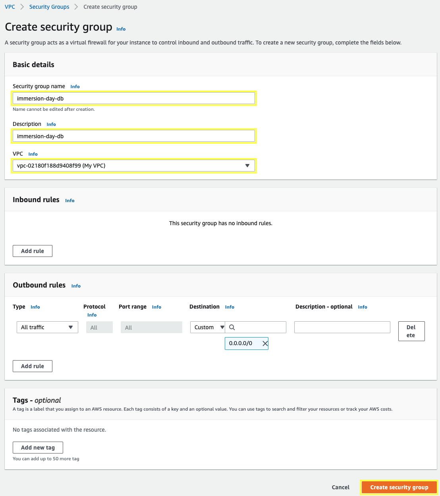
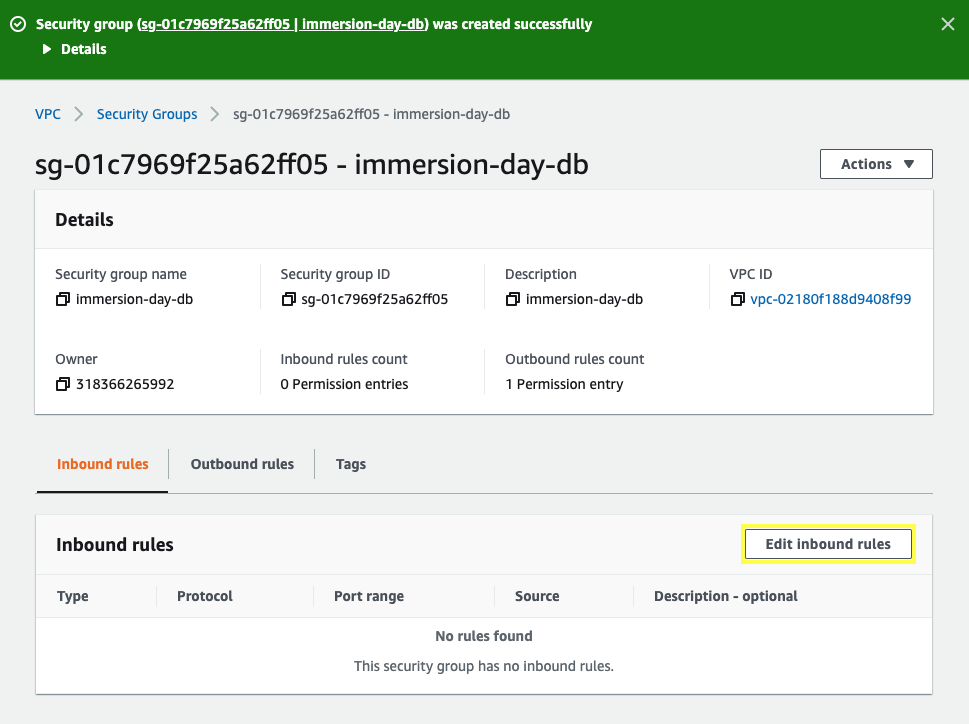
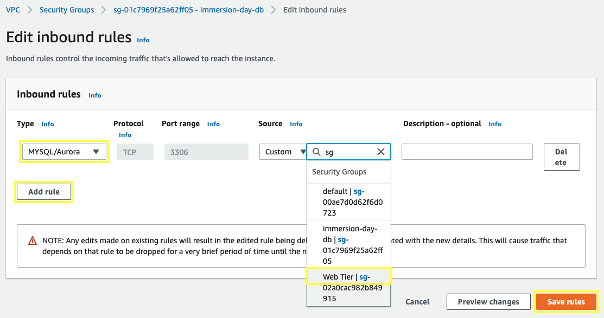

1.1\. Open the Amazon VPC console at https://console.aws.amazon.com/vpc/.

2.2\. In the navigation pane, choose **Security Groups**.

1.3\. Choose **Create security group**.

1.4\. For the **Security group name** and **Description** type `immersion-day-db`. For **VPC** select your VPC ID **My VPC**, and choose **Create security group**.

1.5\. For you security group **immersion-day-db**, choose **Edit inbound rules**.

1.6\. In the dialog, choose **Add Rule**, add the following rules and Choose **Save rules**:

* **Type:** `MYSQL/Aurora`
* **Protocol:** `TCP`
* **Port Range:** `3306`
* **Source:** `Custom sg-XXXXXXX` Type `sg-` and select the security group ID for **Web Tier**

