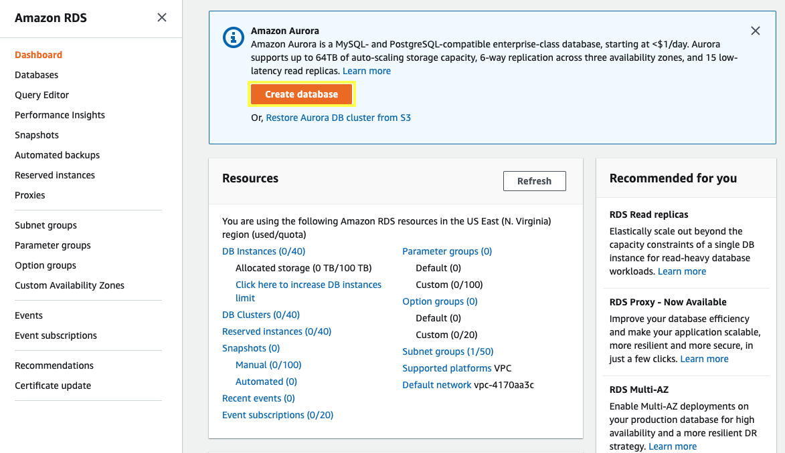
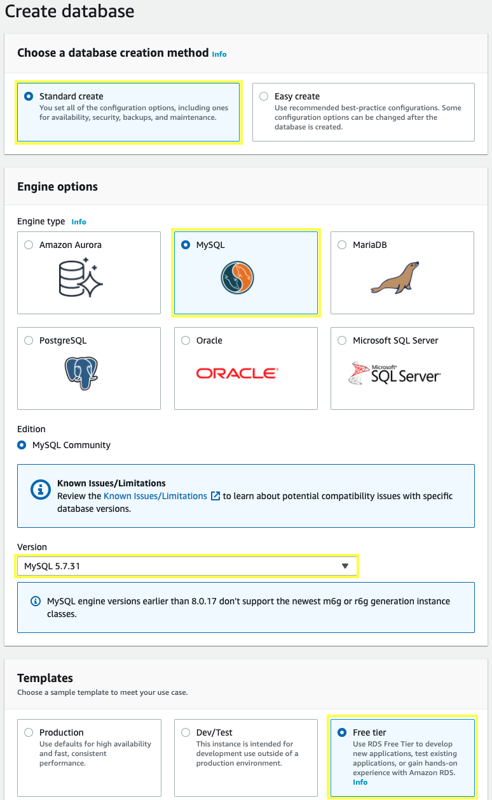
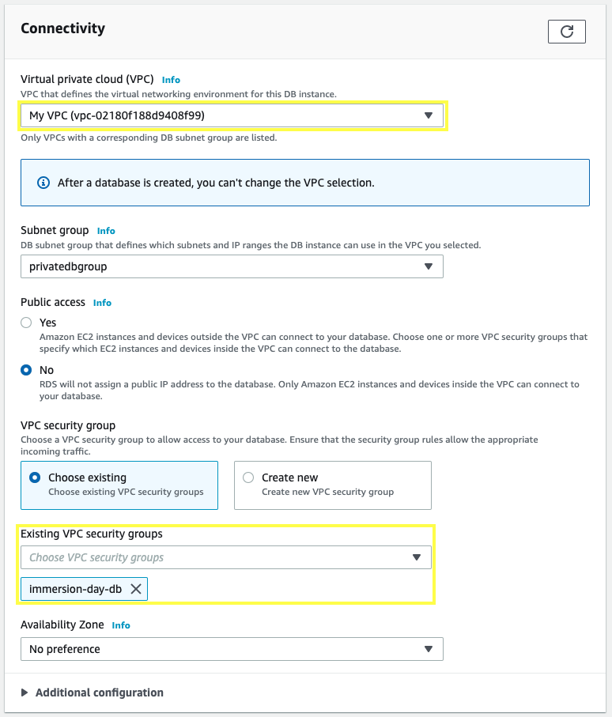
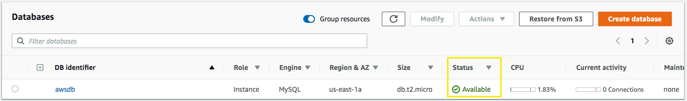

Now that our VPC security group and subnet group are ready, let’s configure and launch a MySQL RDS Instance.

3.1\. Open the Amazon RDS console at  https://console.aws.amazon.com/rds.

3.2\. Click on **Create database**.

3.3\. We will be using a **Standard Create** method, choose **MySQL** from the **Engine Options**, scroll down and in **Templates** section select **Free tier**.

3.4\. Scroll down, for the **Settings** section fill out with the following information:

* **DB instance identifier:** `awsdb`
* **Master username:** `awsuser`
* **Master Password:** `awspassword`
* **Confirm Password:** `awspassword`

3.5\. Scroll down, for the **DB instance size** and **Storage** sections leave the values as default.

3.6\. Scroll down, for the **Connectivity** section select your **My VPC** and for **VPC security group** select **immersion-day-db** and remove the **default** security group.

3.7\. Scroll down and choose **Create database**. In the RDS Dashboard, monitor your new DB instance until the status changes from “**Creating**” to “**Backing-up**” to “**Available**”.

{}
This may take up to 5 minutes as the database is being created and backed up, once is in **Available** status you can continue.
{}

3.8\. Choose your database **awsdb**  

3.9\. From the **Connectivity & security** description, copy the **Endpoint** once is available, you will use it in the next section.

