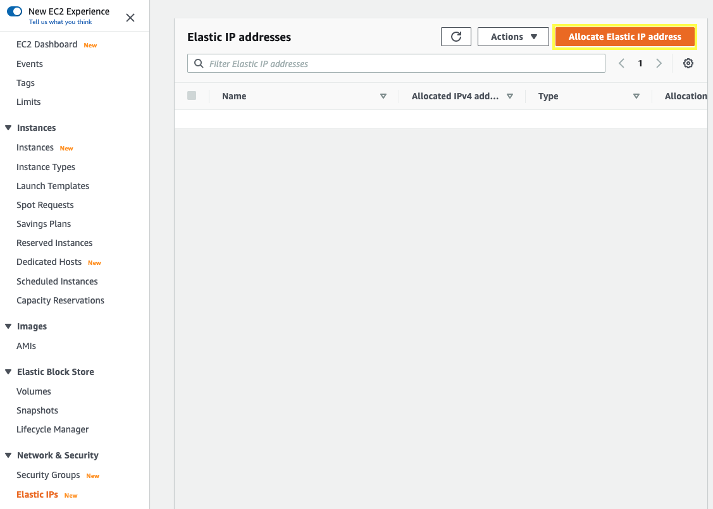
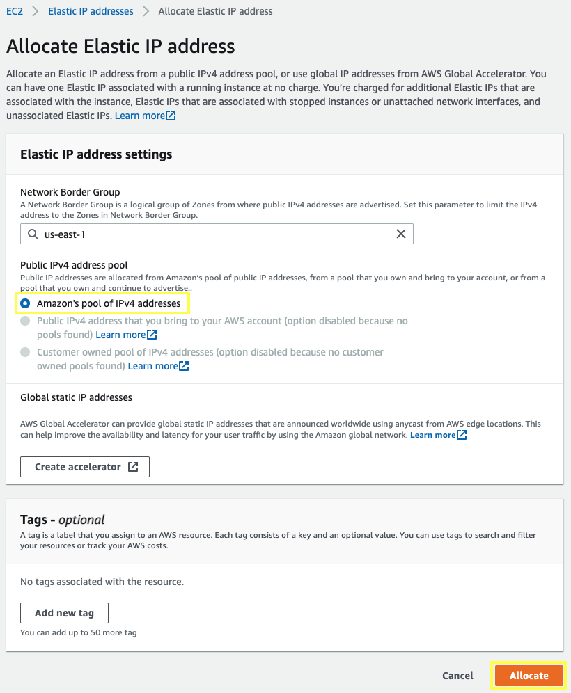
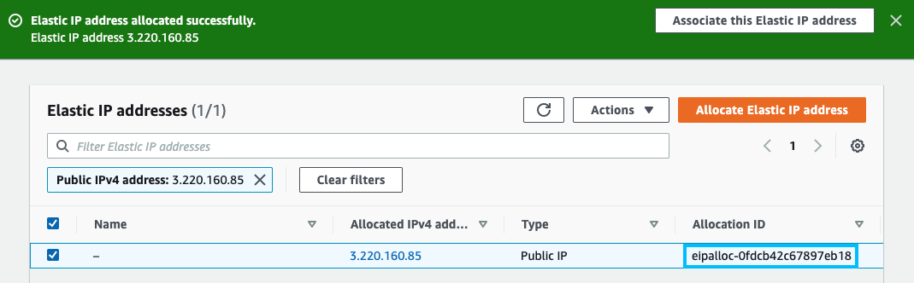

1.1\. Open the Amazon EC2 console at https://console.aws.amazon.com/ec2/.

1.2\. In the navigation pane, choose **Elastic IPs**.

1.3\. Choose **Allocate Elastic IP address**.

1.4\. Use the **Amazon's pool of IPv4 addresses** and Choose **Allocate**.

1.5\. Note the **Allocation ID** for your newly created Elastic IP address; you enter this later in the VPC wizard.

