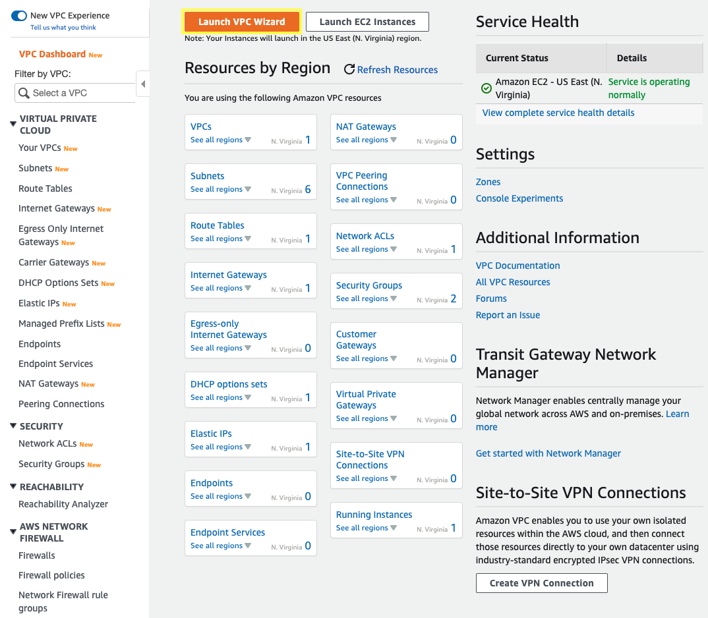
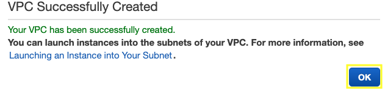
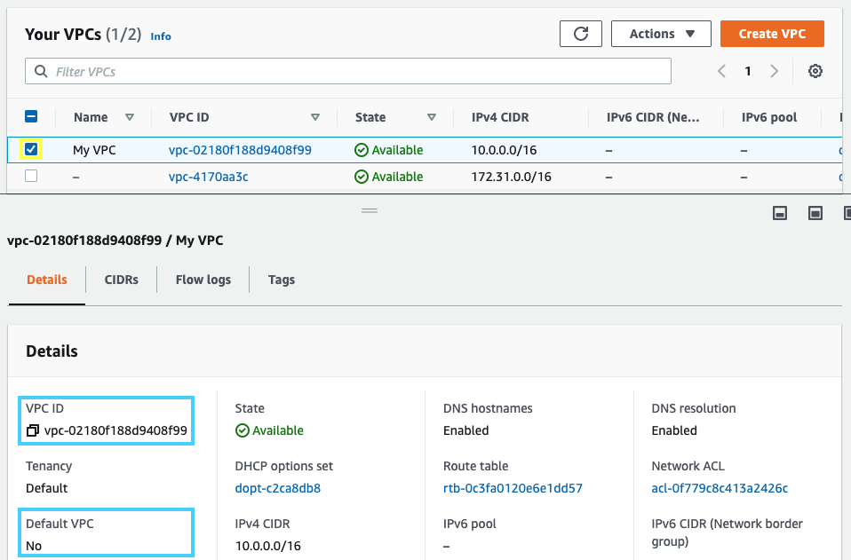
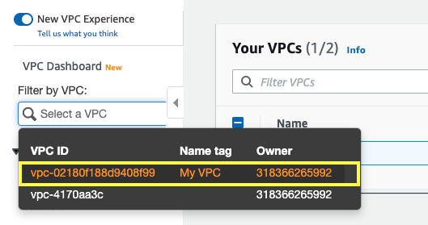
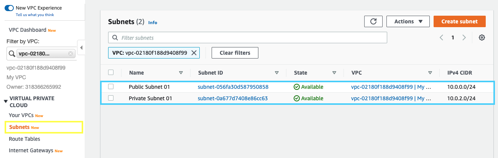
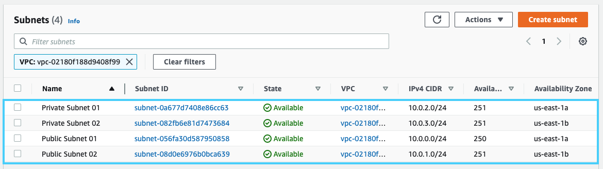
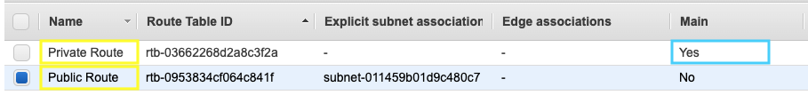

2.1\. Open the Amazon VPC console at https://console.aws.amazon.com/vpc/.

2.2\. From the **VPC Dashboard** choose **Launch VPC Wizard**.

2.3\. Choose the second option, **VPC with Public and Private Subnets**, and then choose **Select**.

2.4\. On the configuration page, enter the following information and choose **Create VPC**.

* **IPv4 CIDR block:** `10.0.0.0/16`
* **VPC name:** `My VPC`
* **Public subnet's IPv4 CIDR:** `10.0.0.0/24`
* **Availability Zone:** `us-east-1a`
* **Public subnet name:** `Public Subnet 01`
* **Private subnet's IPv4 CIDR:** `10.0.2.0/24`
* **Availability Zone:** `us-east-1a`
* **Private subnet name:** `Private Subnet 01`
* **Elastic IP Allocation ID:** Select your Allocation ID previously created `eipalloc-XXXXXXXXXXXXXX`
* **Enable DNS hostnames:** `Yes`

2.5\. A status window shows the work in progress, when the wizard is finished, choose **OK**.

2.6\. Note that the page displays your VPCs. The VPC that you created is a nondefault VPC, therefore the **Default VPC** column displays **No**, copy the **VPC ID** of **My VPC**.

2.7\. **Refresh your web console** to update the interface and in the navigation pane, for **Filter by VPC:** select your VPC to filter all the resources related to your VPC.

2.8\. In the navigation pane, choose **Subnets**, you will see two subnets created from your VPC in availability zone a (us-east-1a).

{}
For greater availability, you should create at least one more of each subnet type in a different Availability Zone so that your VPC has both public and private subnets across two Availability Zones.
{}

2.9\. For the second public subnet, choose **Create subnet** and enter the following information and choose **Create**.

* **VPC ID**: `ID (My VPC)`
* **Subnet name**: `Public Subnet 02`
* **Availability Zone**: `us-east-1b`
* **IPv4 CIDR block**: `10.0.1.0/24`

2.10\. For the second private subnet, choose **Create subnet** and enter the following information and choose **Create**.

* **VPC ID**: `ID (My VPC)`
* **Subnet name**: `Private Subnet 02`
* **Availability Zone**: `us-east-1b`
* **IPv4 CIDR block**: `10.0.3.0/24`

2.11\. Now you will see the four subnets, two publics and two privates.

2.12\. In the navigation pane, choose **Route Tables**, note that one of your route tables for the **Main** column displays **Yes**.

2.13\. Edit the names, mouse over the column **Name** and click on the pencil, for the **Main** route table type `Private Route` and for the other one type `Public Route`.

2.14\. Select your **Public Route**, click on **Subnet Associations** and click on **Edit subnet associations**.

2.15\. Select the subnets **10.0.0.0/24** (Public Subnet 01) and **10.0.1.0/24** (Public Subnet 02) and click on **Save**.

**Great Job: You have successfully deployed a VPC network with public and private subnets!!!**