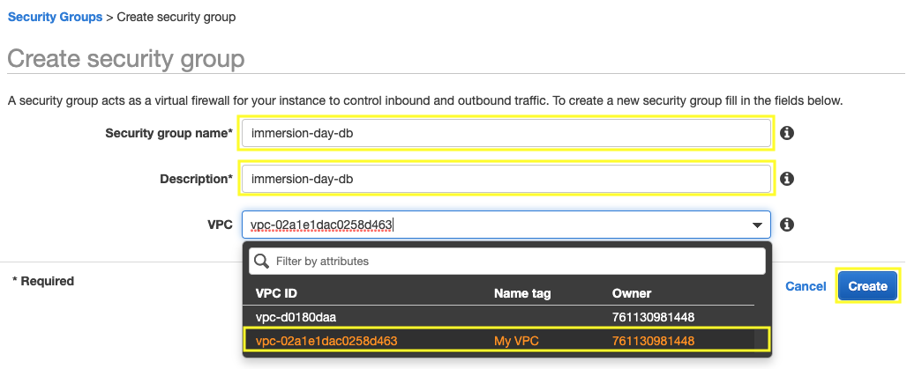
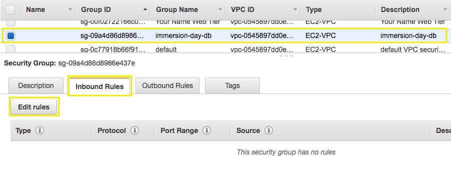
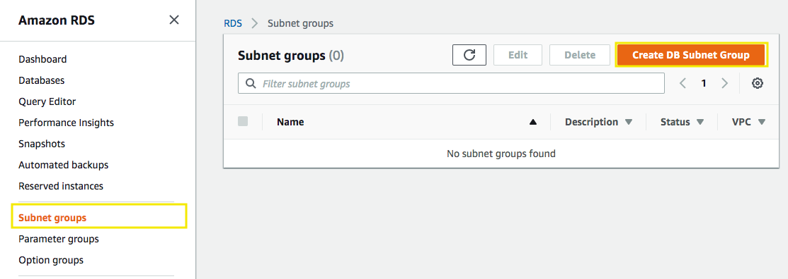
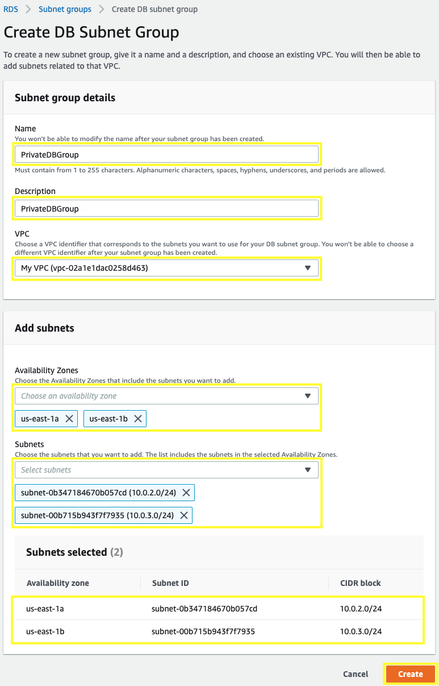
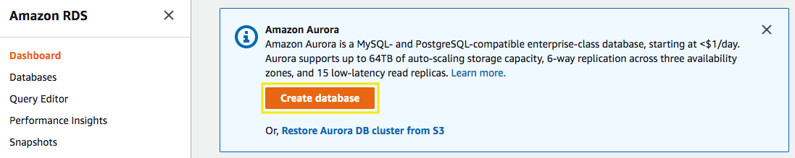
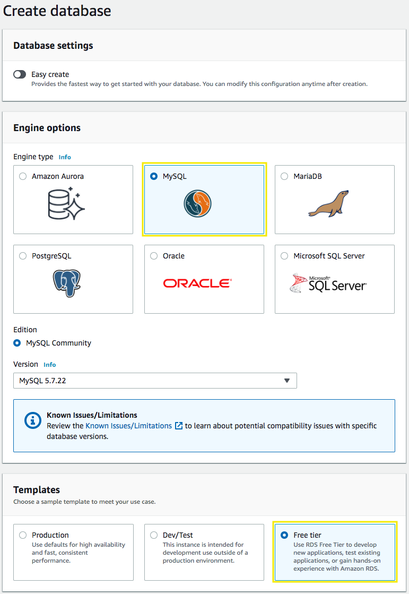
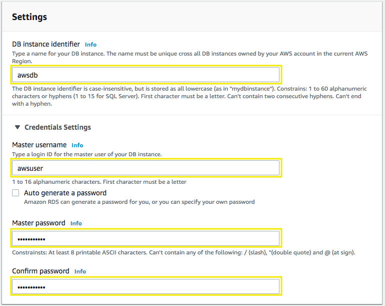
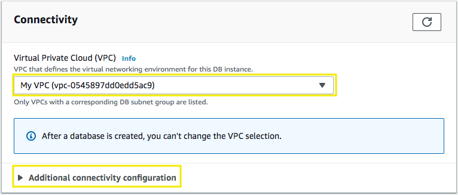
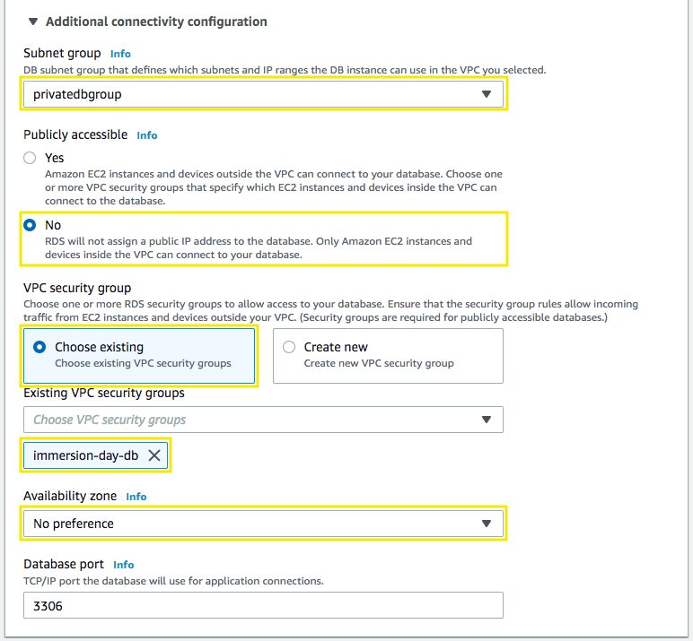
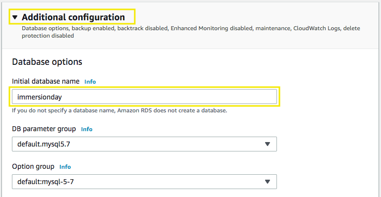

# Getting Started with Amazon RDS

[!embed?max_width=1200](https://www.youtube.com/watch?v=eMzCI7S1P9M)

[Amazon Relational Database Service (Amazon RDS)](https://aws.amazon.com/rds/) is a managed service that makes it easy to set up, operate, and scale a relational database in the cloud. It provides cost-efficient and resizable capacity, while managing time-consuming database administration tasks, freeing you up to focus on your applications and business.

## 1. Create the Security Group

1.1\. Open the Amazon VPC console at https://console.aws.amazon.com/vpc/.

2.2\. In the navigation pane, choose **Security Groups**.

1.3\. Choose **Create security group**.

1.4\. For the **Security group name** and **Description** type `immersion-day-db`. For **VPC** select your VPC ID **My VPC**, and choose **Create** and **Close**.

1.5\. Select the security group **immersion-day-db**, on the **Inbound Rules** tab, choose **Edit rules**.

1.6\. In the dialog, choose **Add Rule** and add the following rules:

* **Type:** `MYSQL/Aurora`
* **Protocol:** `TCP`
* **Port Range:** `3306`
* **Source:** `Custom sg-XXXXXXX` Type `sg-` and select the security group ID for **Web Tier**

1.7\. Choose **Save rules** and **Close**.

## 2. Create a DB Subnet Group

You will create a DB subnet group that is a collection of subnets (private subnets) designated for your DB instance.

2.1\. Open the Amazon RDS console at  https://console.aws.amazon.com/rds.

2.2\. In the navigation pane, choose **Subnet groups** and click on **Create DB Subnet Group**.

2.3\. For **Name** and **Description** type `PrivateDBGroup`.

2.4\. For the VPC select **My VPC**.

2.5\. In **Add subnets** section, select the Private Subnets, from **us-east-1a** select **10.0.2.0/24** (Private Subnet 01), and for **us-east-1b** select **10.0.3.0/24** (Private Subnet 02). Choose **Create**.

## 3. Launch an RDS Instance

Now that our VPC security group and subnet group are ready, let’s configure and launch a MySQL RDS Instance.

3.1\. Open the Amazon RDS console at  https://console.aws.amazon.com/rds.

3.2\. Click on **Create database**.

3.3\. We will be using a **Standard Create** method, choose **MySQL** from the **Engine Options**, scroll down and in **Templates** section select **Free tier**.

3.4\. Scroll down, for the **Settings** section fill out with the following information:

* **DB instance identifier:** `awsdb`
* **Master username:** `awsuser`
* **Master Password:** `awspassword`
* **Confirm Password:** `awspassword`

3.5\. Scroll down, for the **DB instance size** and **Storage** sections leave the values as default.

3.6\. Scroll down, for the **Connectivity** section select your **My VPC** and click on **Additional connectivity configuration**.

3.7\. Scroll down and for the **Additional connectivity configuration** section select as follows:

* **Subnet group:** `privatedbgroup`
* **Publicly accessible:** `No`
* **VPC security groups:** Select **Choose existing**, then select **immersion-day-db** and remove the **default** security group.
* **Availability zone:** `No Preference`

3.8\. Scroll down and click on **Additional configuration**, fill out as follows:

* **Initial database name:** `immersionday`.

3.9\. Scroll down and choose **Create database**. In the RDS Dashboard, monitor your new DB instance until the status changes from “**Creating**” to “**Backing-up**” to “**Available**”.

!!! info
    This may take up to 5 minutes as the database is being created and backed up, once is in **Available** status you can continue.

3.10\. Choose your database **awsdb**  

3.11\. From the **Connectivity & security** description, copy the **Endpoint** once is available, you will use it in the next section.

## 4. Configure Instance to Leverage RDS

We provided an example database table and sample code for creating a simple address book.  Before configuring your instance, you will need to get the URL for your database endpoint.

4.1\. In the RDS console, click on **Instances** and then select your database instance, **awsdb**.

4.2\. Scroll down to the Connect section and check the value under **Endpoint**. Remember this because you will need it in a minute.

4.3\. Navigate to the browser tab connected to web application you launched previously in **Getting Started with Linux on Amazon EC2** lab, click on **RDS**. You should see a prompt to enter the **Endpoint** (**Endpoint copied**), **Database** (`immersionday`), **Username** (`awsuser`) and **Password** (`awspassword`) information you just created. Click the **Submit** button.

4.4\. When complete, you will be redirected to a simple page displaying all of the information from the database you just created.

This is a very basic example of a simple address book interacting with a MySQL database managed by AWS.  RDS can support much more complicated relational database scenarios, but we hope this simple example will suffice to demonstrate the point.

Feel free to play around with the address book and add/edit/remove content from your RDS database by using the Add Contact, Edit, and Remove links in the Address Book.

**Great Job: You have successfully deployed and utilized an AWS managed MySQL database!!!**