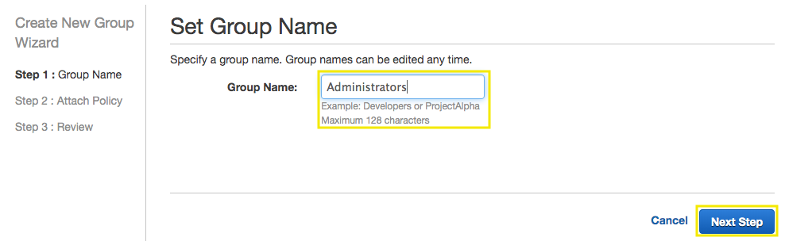
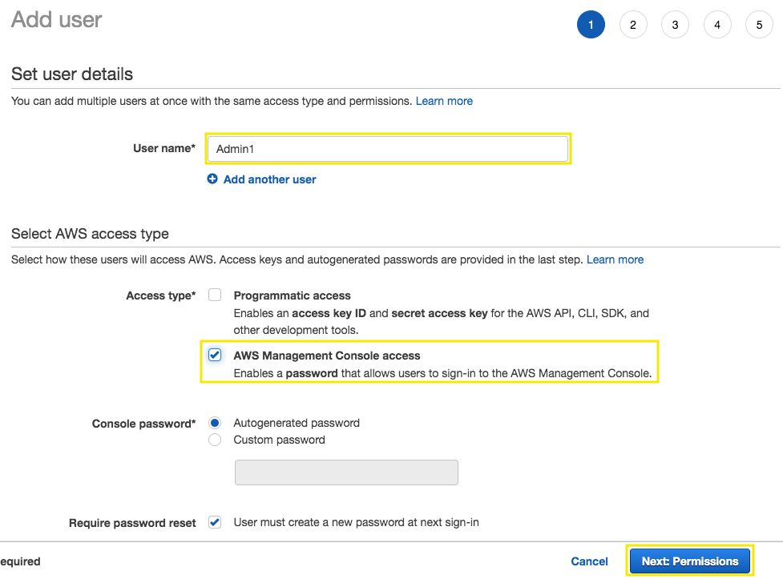
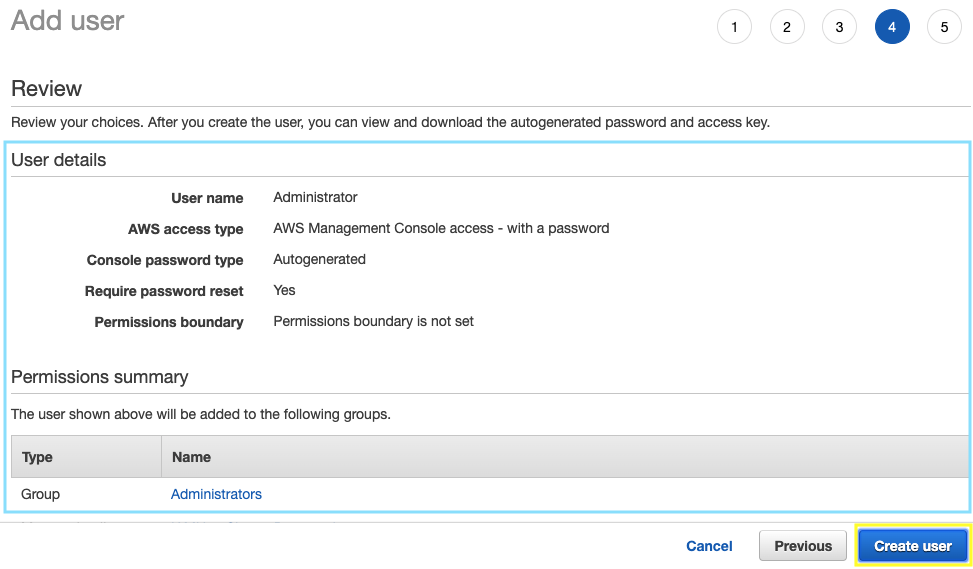
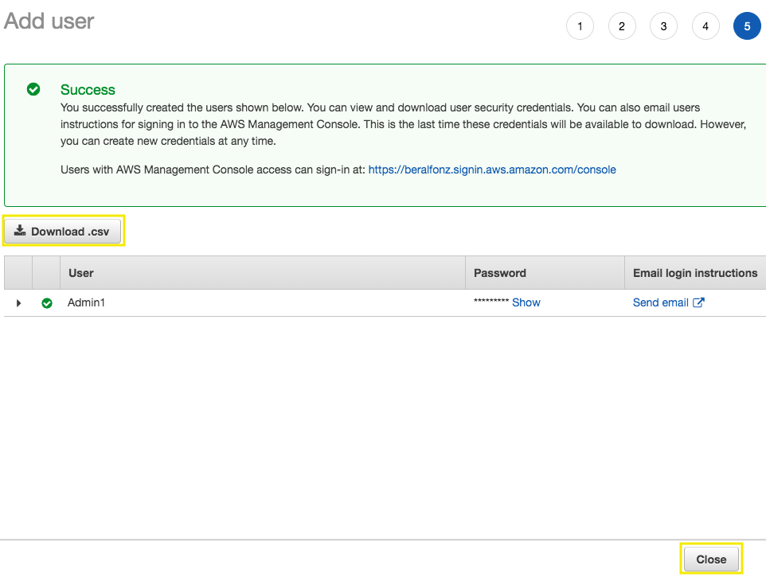

# Getting Started with Identity & Access Management

[!embed?max_width=1200](https://www.youtube.com/watch?v=Ul6FW4UANGc)

[AWS Identity and Access Management (IAM)](https://aws.amazon.com/iam/) enables you to manage access to AWS services and resources securely. Using IAM, you can create and manage AWS users and groups, and use permissions to allow and deny their access to AWS resources. 

## 1. Create an IAM Group

An IAM group is a collection of users. Groups are often based on job function or role. They allow you to manage permissions by applying policies to each group rather than individual users.

1.1\. Open the IAM console at https://console.aws.amazon.com/iam/.

1.2\. In the navigation pane, click **Groups** and then click **Create New Group**.

1.3\. In the **Group Name** box, type `Administrators` as the name of the group and then click **Next Step**.

1.4\. In the list of policies, select the check box for **AdministratorAccess** policy that you want to apply to all members of the group. Then click **Next Step**.

1.5\. Click **Create Group**.

## 2. Create an IAM User

A user is associated with permanent credentials and has permissions based off of policies attached directly to the user or policies attached to a group to which the user belongs.

2.1\. Open the IAM console at https://console.aws.amazon.com/iam/.

2.2\. In the navigation pane, choose **Users** and then choose **Add user**.

2.3\. In the **User Name** box, type `Administrator` as the name of the user, for **Access type** select the check box **AWS Management Console access** and then click **Next: Permissions**.

2.4\. On the **Set permissions** page, select the check box for **Administrators** group and then click **Next: Tags**.

2.5\. On the **Add Tags** page choose **Next: Review**.

2.6\. On the **Review** page you will see all of the choices you made up to this point. When you are ready to proceed, choose **Create user**.

2.7\. To save the credentials, choose **Download .csv** and then save the file to a safe location, and **Close**.

!!! info
    Open the csv file and use the new credentials to get into your AWS Console with administrator access.