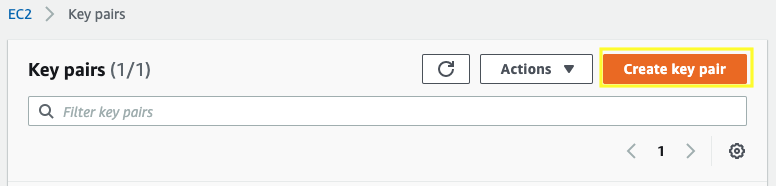
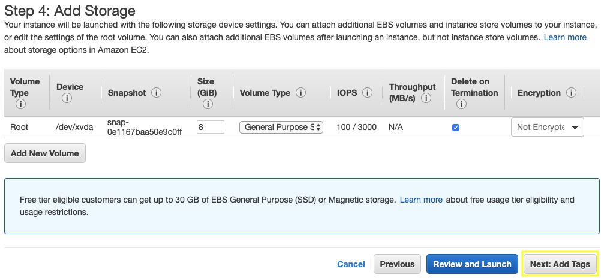
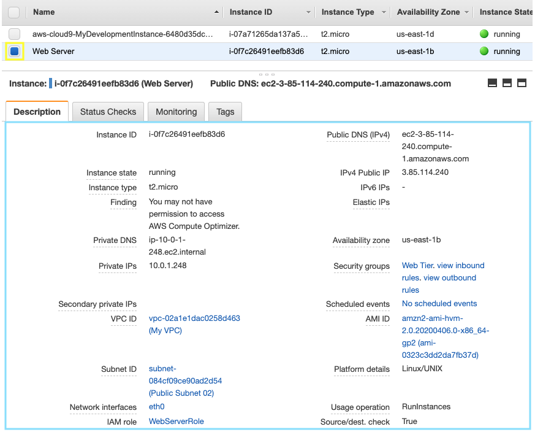
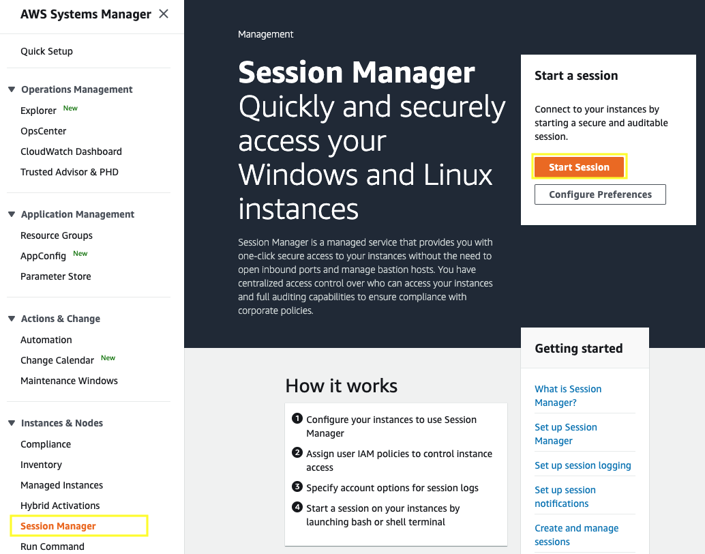
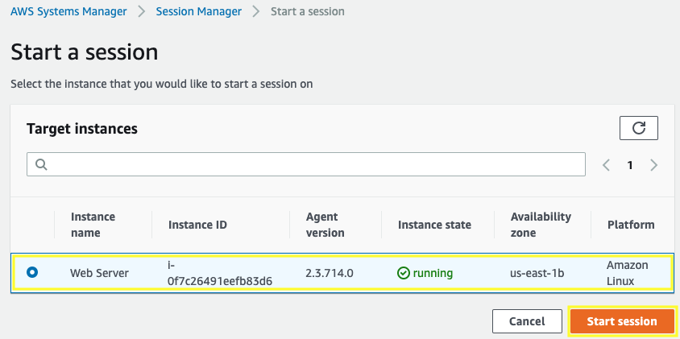
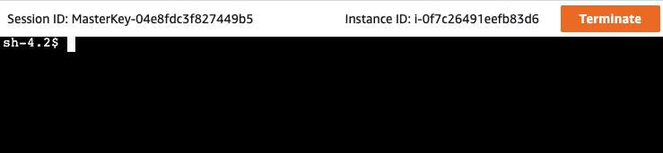

# Getting Started with Linux on Amazon EC2

[!embed?max_width=1200](https://www.youtube.com/watch?v=TsRBftzZsQo)

[Amazon Elastic Compute Cloud (Amazon EC2)](https://aws.amazon.com/ec2/) is a web service that provides secure, resizable compute capacity in the cloud. It is designed to make web-scale cloud computing easier for developers.

## 1. Create a new Key Pair

With the following steps you will create a unique SSH keypair to connect to your EC2 instance.

1.1\. Open the Amazon EC2 console at https://console.aws.amazon.com/ec2.

1.2\. Click on **Key Pairs** in the **NETWORK & SECURITY** section menu. This will display a page to manage your key pairs.

1.3\. To create a new key pair, click the **Create Key Pair** button at the top of the browser window.



1.4\. For **Name** type `my-private-key`, for **File format** select **pem** and click **Create key pair**.


1.5\. The page will download the file ***my-private-key.pem** to the local drive. Follow the browser instructions to save the file to the default download location.

1.6\. Remember the full path to the file .pem file you just downloaded.

!!! info
    With the key pair you can [connect to your Linux instance using SSH](https://docs.aws.amazon.com/AWSEC2/latest/UserGuide/AccessingInstancesLinux.html).


## 2. Create an IAM Role for your EC2 instance

We are going to create an IAM role and attach it to an instance during or after launch. With this we will have permissions for AWS Systems Manager to use Session Manager and have access to the Linux EC2 instance.

2.1\. Open the IAM console at https://console.aws.amazon.com/iam/.

2.2\. In the navigation pane, choose **Roles** and then choose **Create role**.


2.3\. Choose **EC2** from the list of services, then **Next: Permissions**.


2.4\. For **attach permissions policies** filter by typing **AmazonEC2RoleforSSM** and from the list select **AmazonEC2RoleforSSM**, choose **Next: Tags**.


2.5. For Add tags choose **Next: Review**.

2.6. For **Role name**, type `WebServerRole` and choose **Create Role**.

## 3. Launch a Web Server Instance

We will launch an Amazon Linux 2 instance, bootstrap Apache/PHP, and install a basic web page that will display information about our instance.

3.1\. Open the Amazon EC2 console at https://console.aws.amazon.com/ec2.

3.2\. Click on **Launch Instance**.


3.3\. In the **Step 1: Choose an Amazon Machine Image (AMI)** section, select the first Amazon Linux 2 AMI and click **Select**.


3.4\. In the **Step 2: Choose an Instance Type** section, select the **t2.micro** instance size and click **Next: Configure Instance Details**.


3.5\. In the **Step 3: Configure Instance Details** section, select your network **My VPC** created and the **Public Subnet 01**, for Auto-assign Public IP select **Enable**, for IAM role select **WebServerRole**, expand the **Advanced Details** section, copy/paste the script below into the **User Data** field (this shell script will install Apache & PHP, start the web service, and deploy a simple web page). Click **Next: Add Storage**.

```console
#include
https://s3.amazonaws.com/immersionday-labs/bootstrap.sh
```


3.6\. In **Step 4: Add Storage** section you have the ability to modify or add storage and disk drives to the instance. For this lab, we will simply accept the storage defaults and click **Next: Add Tags**.



3.7\. In **Step 5: Add Tags** section we will choose a “friendly name” for the instance by choosing **Add Tag**. Tag it with **Key**: `Name` and  **Value**: `Web Server`. It makes it easy to keep track of running machines in a complex environment. Click **Next: Configure Security Group**.


3.8\. In **Step 6: Configure Security Group** section you will create a new security group, which will be your firewall. On the assumption that we are building out a Web server, name your new security group `Web Tier`, and confirm an existing **SSH** rule exists which allows **TCP** port **22** from Anywhere. Click **Add Rule**:

3.9\. Select HTTP from the **Type** dropdown menu, and confirm **TCP** port **80** is allowed from Anywhere (you’ll notice, that “Anywhere is the same as ‘0.0.0.0/0’).  Click **Add Rule**. 

3.10\. Click the **Review and Launch** button after configuring the security group.


3.11\. In **Step 7: Review Instance Launch** section, review your cofiguration and then click **Launch**.


3.12\. Select the key pair that you created in the beginning of this lab from the drop-down and check the **I acknowledge** checkbox. Then click the **Launch Instances** button.


3.13\. Scroll down and click the **View Instances** button in the lower righthand portion of the screen to view the list of EC2 instances. Once your instance has launched, you will see your Web Server as well as the Availability Zone the instance is in, and the publicly routable DNS name.

3.14\. Click the checkbox next to your web server to view details about this EC2 instance.



## 4. Browse the Web Server

4.1\. Wait for the instance to pass the Status Checks to finish loading.

4.2\. In the **Description** of the EC2 instance you can find the Public DNS name, copy it and paste in a new browser tab and browse the Web Server by entering Public DNS name into the browser.


You should see a website that looks like the following:


## 5. Connect to the shell of you Linux EC2 instance

[!embed?max_width=1200](https://www.youtube.com/watch?v=MK4ZoCs-muo)

You can use the key pair to connect to your Linux EC2 instance by SHH client, for this purpose we are going to use [AWS Systems Manager](https://aws.amazon.com/systems-manager/) using [Session Manager](https://docs.aws.amazon.com/systems-manager/latest/userguide/session-manager.html).
Systems Manager Gain Operational Insight and Take Action on AWS Resources. We are going to take a look a just one of seven capabilities of Systems Manager.

5.1\. Open de AWS Systems Manager console at https://console.aws.amazon.com/systems-manager/. 

5.2\. From the menu on the left, scroll down and select **Session Manager**. Session Manager allows us to use IAM roles and policies to determine who has console access without having to manage SSH keys for our instances. In the main pane, click the **Start session** button. 



5.3\. Select the radio button next to the instance you wish to log into.



5.4\. You will now receive a Bash shell prompt for that instance.



**Great Job! You have deployed a server and launched a web site in a matter of minutes!!**