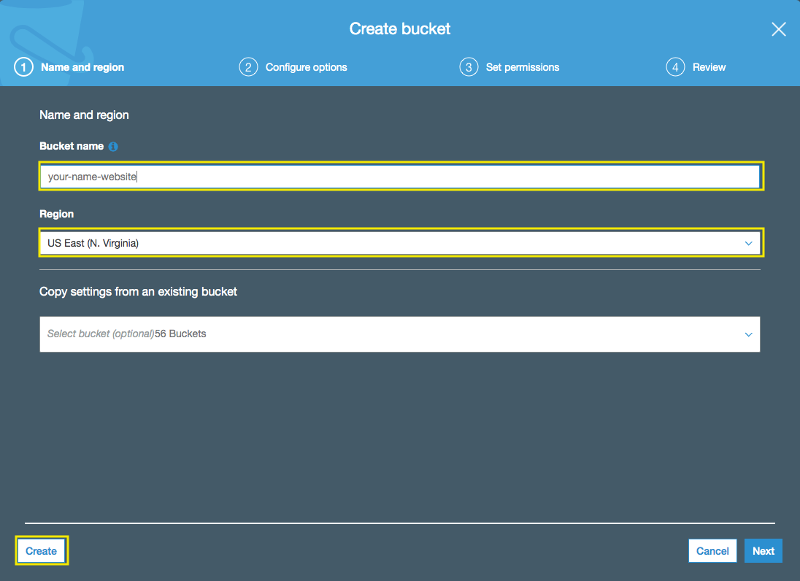
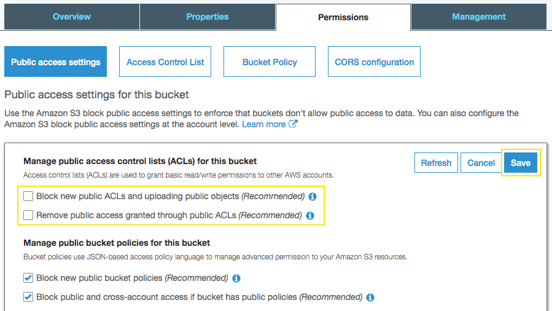

# Getting Started with Amazon S3

## 1. Create an Amazon S3 bucket

1.1\.	Open the Amazon S3 console at https://console.aws.amazon.com/s3/.

1.2\.	Choose **Create bucket**.

1.3\.	In the **Bucket name** field, type a unique DNS-compliant name for your new bucket, for example `<your-name>-website`.

* The name must be unique across all existing bucket names in Amazon S3.
* After you create the bucket you cannot change the name, so choose wisely.
* Choose a bucket name that reflects the objects in the bucket because the bucket name is visible in the URL that points to the objects that you're going to put in your bucket.

1.4\.	For Region, choose **US East (N. Virginia)** as the region where you want the bucket to reside.

1.5\.	Choose **Create**.



## 2. Editing Public Access Settings for an S3 Bucket

2.1\.	Open the Amazon S3 console at https://console.aws.amazon.com/s3/.

2.2\.	In the **Bucket name** list, choose the name of the bucket that you created **<your-name>-website**.

2.3\.	Choose **Permissions**.

2.4\.	Choose **Edit** to change the public access settings for the bucket.

2.5\.	Uncheck the following two options:

* **Block new public ACLs and uploading public objects (Recommended).**
* **Remove public access granted through public ACLs (Recommended).**



2.6\.	Choose **Save**.

2.7\.	When you're asked for confirmation, enter `confirm`. Then choose **Confirm** to save your changes.

## 3. Create a Cloud9 instance to upload your static Website

3.1\. Open the AWS Cloud9 console at https://console.aws.amazon.com/cloud9/.

3.2\. Click on **Create environment**.


3.3\. For the **Name** type `MyDevelopmentInstance`, and choose **Next step**.


3.4\. For the **Environment settings** use the default values and choose **Next step**.

3.5\. Click on **Create environment**.

3.6\. Wait some seconds until your development environment is ready, you will see the following screen.


3.7\. Inside the bash terminal execute the following commands, change **<you-name>-website** with your bucket name.

```console
git clone https://github.com/aurbac/static-website.git
aws s3 cp static-website/ s3://<you-name>-website/ --recursive --exclude ".git/*" --acl public-read
```

## 4. Configure the S3 bucket for static website hosting

4.1\. Open the Amazon S3 console at https://console.aws.amazon.com/s3/.

4.2\. In the **Bucket name** list, choose the name of the bucket that you created **<your-name>-website**.

4.3\. Choose **Properties**.

4.4\. Choose **Static website hosting**.


4.5\. Choose **Use this bucket to host** and for **Index document** type `index.html`, copy the **Endpoint** and click **Save**.


4.6\. Open a new browser tab and browse the WebSite by entering Endpoint. You should see a website that looks like the following:

